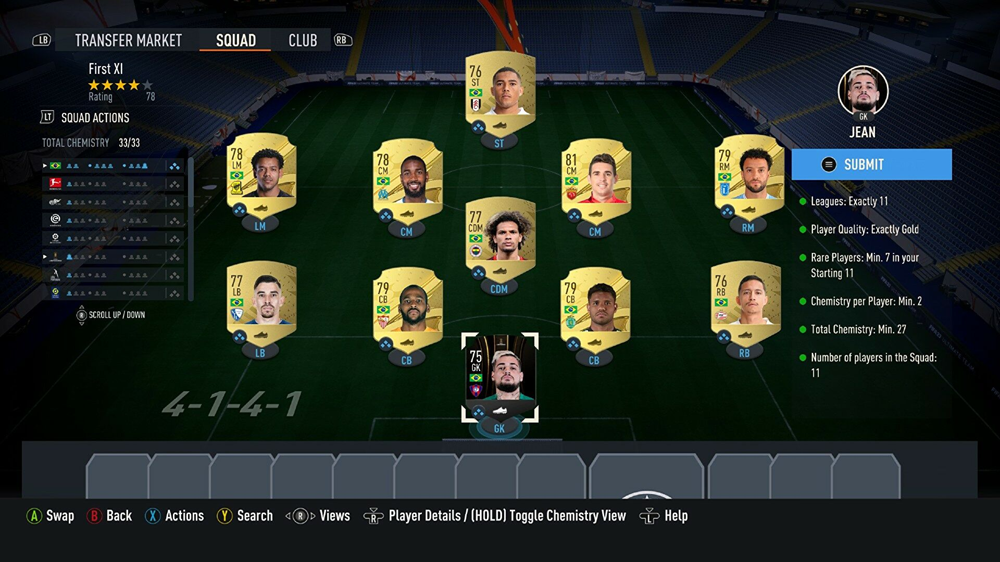
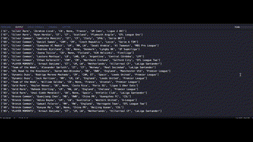
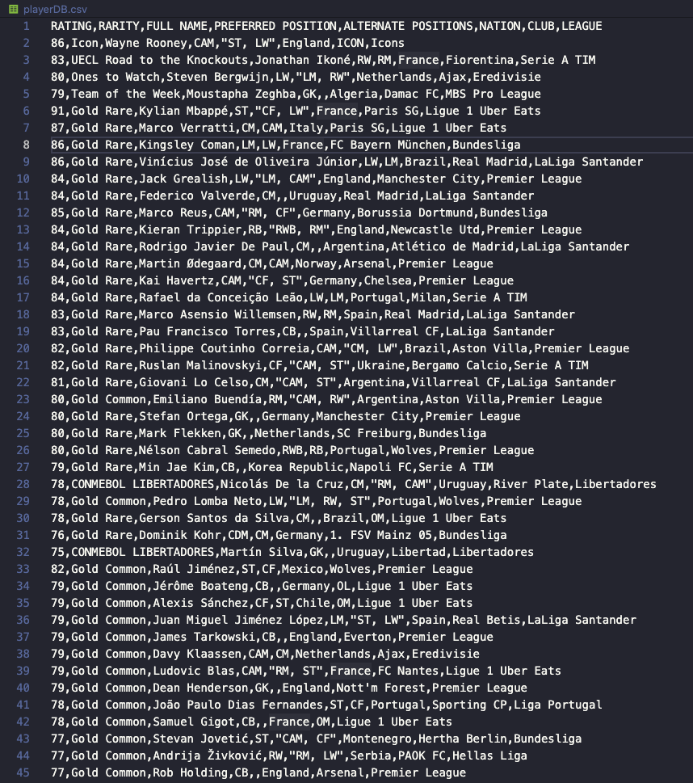
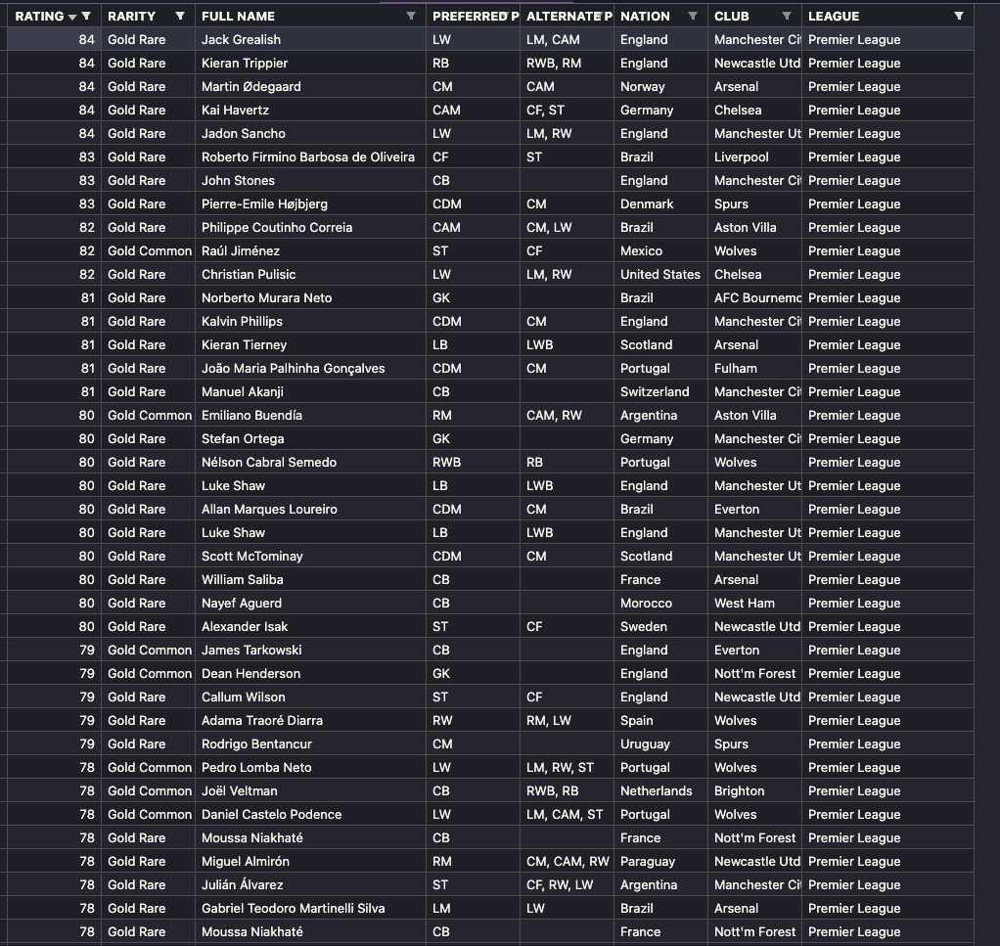

# Fut 23 Player Web Scraper

## What are SBC's?

In FIFA ultimate team, there is a mode to get rewards called Squad Building Challenges or SBC's. This mode gives you an empty squad you have to fill with players from your club that meet certain requirements. As seen in the image below:

These challenges are tedious to complete, in part because the UI requires many steps to look for players within your club.

This web scraper navigates the FUT 23 web app and scans all the players in your current club and dumps them into a CSV file. This can be opened in excel or viewed with a CSV extension. There you can filter by rating, nation, league, or club which helps when doing SBC's because you have easy view access to all your players with their respective attributes.

## Demo

# Final Output

